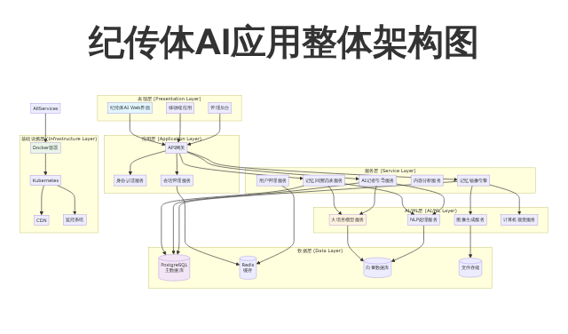
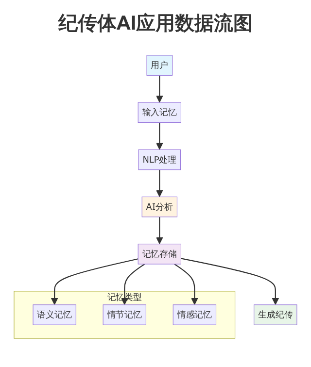

# 纪传体AI应用系统架构设计蓝图

## 执行摘要与范围界定

纪传体AI应用的核心目标,是以结构化方式采集、提炼与再现个体的生命历程,并将其沉淀为可检索、可追溯、可传播的纪传作品。本设计蓝图围绕四大子系统展开:记忆回溯访谈系统、AI记者引导系统、记忆镜像引擎(图生图)、以及整体技术栈与运维体系。我们以“叙事驱动、证据可溯、隐私优先、可扩展与可观测”为原则,提出一套从用户界面到服务编排、从数据治理到安全合规的端到端架构方案。

在业务价值上,系统通过多轮对话与提示工程,引导用户从日常琐碎中抽丝剥茧,形成时间轴、主题与人物关系等多维度的记忆结构;通过图生图引擎,将文本记忆转化为可视化的“镜像”,辅助回忆、增强共情,并为纪传作品提供插图;在工程层面,系统采用模块化微服务与事件驱动架构,确保低耦合与高可用,同时以统一的鉴权、审计与可观测体系降低运维复杂度与合规风险。

范围界定方面,本蓝图覆盖从用户交互到后端服务编排、从数据模型到治理流程、从模型接入到推理加速、从部署架构到安全合规的完整设计,不涉及具体第三方供应商的选型评测与商业条款谈判。成功度量侧重于四类指标:叙事质量(结构清晰度、细节丰富度)、用户参与度(留存、会话深度)、图像生成质量(分辨率、一致性、可控性)、系统可靠性(SLO达成、故障恢复能力)。这些指标将通过统一埋点、日志与分布式追踪进行持续度量与优化。

为便于读者快速把握系统与指标的对应关系,表1给出了目标—指标—度量方式的映射。

表1 目标—指标—度量方式映射表
| 目标 | 指标 | 度量方式 | 目标值(首期) | 适用子系统 |
|---|---|---|---|---|
| 提升叙事质量 | 结构清晰度 | 专家评分(1–5),主题连贯性算法得分 | ≥4.0 | 访谈系统、记者系统 |
| 提升叙事质量 | 细节丰富度 | 每主题平均事件数/细节密度 | ≥8事件/主题 | 访谈系统、记者系统 |
| 提升用户参与度 | 会话深度 | 每会话平均轮次/停留时长 | ≥12轮/≥10分钟 | 访谈系统、记者系统 |
| 提升图像质量 | 图像一致性 | 角色/场景跨时点一致性评分(人工+模型) | ≥85/100 | 镜像引擎 |
| 提升图像质量 | 提示词对齐度 | CLIP相似度/人工审核通过率 | ≥0.75/≥90% | 镜像引擎 |
| 系统可靠性 | 可用性 | 月度SLA(成功请求占比) | ≥99.5% | 全局 |
| 系统可靠性 | 故障恢复 | RTO/RPO | RTO≤30分钟/RPO≤5分钟 | 全局 |
| 成本与性能 | 推理时延 | P95端到端时延(访谈/图像) | 访谈≤2s/图像≤20s | 推理网关 |
| 成本与性能 | 资源利用率 | GPU/CPU/内存利用率 | GPU≥60%/CPU≥50% | 资源编排 |

上述指标的意义在于:叙事质量与参与度直接决定产品的用户价值与留存;图像质量与一致性决定镜像在纪传作品中的可信度与美学表现;可靠性与性能指标确保规模化运营的稳定;成本与资源利用率指标为持续优化提供方向。

信息缺口与假设说明:当前尚未明确目标用户画像与设备分布、并发规模与地域分布、模型供应商与部署偏好、隐私与合规边界、预算与成本约束、品牌与内容风格指南、可用训练数据与标注资源、多语言与本地化需求、无障碍标准与验收门槛、运维团队能力与工具偏好。这些缺口将在“风险与开放问题”中标注,并在各子系统中以可配置与灰度策略进行风险对冲。

## 系统整体架构设计

### 架构概览

纪传体AI应用采用分层微服务架构，从用户界面到数据存储形成完整的闭环系统。整体架构分为以下层次：

- **表现层**：用户界面和交互逻辑
- **应用层**：业务逻辑和API服务
- **服务层**：核心业务服务和AI服务
- **数据层**：数据存储和管理
- **基础设施层**：云服务和运维支撑

### 核心子系统架构

#### 1. 记忆回溯访谈系统

**架构设计要点：**
- 采用微服务架构，支持水平扩展
- 实时通信采用WebSocket协议
- 前后端分离，便于独立开发和部署
- 集成AI服务进行智能引导

**主要组件：**
- 前端界面服务（React + TypeScript）
- 会话管理服务（Node.js）
- AI引导引擎（Python + FastAPI）
- 实时通信服务（WebSocket Gateway）

#### 2. AI记者引导系统

**架构设计要点：**
- 基于大语言模型的智能引导
- 动态策略调整机制
- 多模态输入处理能力
- 上下文感知和记忆管理

**主要组件：**
- 引导策略引擎（Python）
- 对话管理系统（Node.js）
- 内容分析服务（Python + NLP）
- 用户画像分析器（Python + ML）

#### 3. 记忆镜像引擎

**架构设计要点：**
- 图像生成和处理服务
- 多模态融合技术
- 质量控制和一致性保障
- 高性能图像处理

**主要组件：**
- 图像生成服务（Python + PyTorch）
- 风格控制模块（Python）
- 质量评估服务（Python + CV）
- 图像处理引擎（Python + OpenCV）

#### 4. 整体技术栈

**前端技术栈：**
- React 18 + TypeScript
- Tailwind CSS + Headless UI
- Zustand 状态管理
- React Query 数据获取

**后端技术栈：**
- Node.js + Express.js (API服务)
- Python + FastAPI (AI服务)
- PostgreSQL (主数据库)
- Redis (缓存和会话存储)

**AI/ML技术栈：**
- PyTorch + Transformers
- OpenAI API
- Hugging Face 模型库
- 自定义训练管道

**基础设施：**
- Docker 容器化
- Kubernetes 编排
- AWS/阿里云云服务
- CDN 内容分发

### 系统架构图

*图1: 纪传体AI应用整体架构图 - 展示了从表现层到基础设施层的完整系统架构*

## 领域建模与叙事数据流

纪传体叙事的核心在于将零散的记忆片段,转化为结构化的生命历程表达。我们采用“实体—关系—事件”的领域模型,以叙事为骨架、以证据为肌理,构建从采集到发布的端到端数据流。

核心实体包括:用户(User)、会话(Session)、主题(Topic)、事件(Event)、证据(Evidence)、叙事(Narrative)、媒体资产(MediaAsset)。关系涵盖:时间先后、因果、人物关联、空间关联与主题包含。事件是叙事的基本单元,承载时间、地点、参与者、情感与标签等要素;证据是支持事件真实性的材料,包括文本、图片、音频与外部文档;叙事则是对事件的汇编与阐释,具有版本与发布状态;媒体资产是图像、音频与文档的统一抽象,便于存储与检索。

叙事生命周期遵循:采集—提炼—结构化—校验—发布—回溯。采集阶段以访谈为中心,提炼阶段通过摘要与关键词提取形成主题,结构化阶段将事件落入时间轴与人物关系图,校验阶段通过一致性检查与冲突消解提升可信度,发布阶段将叙事与镜像资产整合输出,回溯阶段支持再访与修订。

数据所有权与访问边界以用户为中心,采用分级访问与可撤销授权。用户对自身数据拥有所有权与撤回权;系统基于最小权限原则控制跨模块访问;所有访问均记录审计日志,确保事后追溯。

为便于工程落地,表2给出实体与核心字段定义,表3给出关系基数与约束。

表2 实体与核心字段定义表
| 实体 | 关键字段 | 类型 | 约束 | 备注 |
|---|---|---|---|---|
| 用户 | id、昵称、偏好、隐私设置 | 字符串/JSON | id唯一、偏好可空 | 用户画像与设置 |
| 会话 | id、用户id、开始/结束时间、轮次 | 字符串/时间/整数 | 轮次≥0 | 访谈会话元数据 |
| 主题 | id、会话id、标题、摘要、关键词 | 字符串/文本 | 标题必填 | 主题提炼结果 |
| 事件 | id、主题id、时间(点/区间)、地点、参与者、情感、标签、文本 | 字符串/时间/地理/文本 | 时间必填 | 叙事基本单元 |
| 证据 | id、事件id、类型、来源、哈希、存储引用 | 字符串/枚举/文本 | 哈希唯一 | 支持真实性校验 |
| 叙事 | id、版本、状态(草稿/已发布)、作者、审校记录 | 字符串/枚举/文本 | 状态枚举 | 作品级输出 |
| 媒体资产 | id、类型(图像/音频/文档)、分辨率/时长、引用、版权元数据 | 字符串/数值/文本 | 引用有效 | 图生图结果与原始材料 |

表3 关系基数与约束表
| 关系 | 基数 | 约束 | 说明 |
|---|---|---|---|
| 用户—会话 | 1:N | 会话必须关联用户 | 多轮访谈记录 |
| 会话—主题 | 1:N | 主题必须来自会话 | 主题提炼 |
| 主题—事件 | 1:N | 事件必须属于主题 | 时间轴构建 |
| 事件—证据 | 1:N | 证据必须关联事件 | 真实性支撑 |
| 事件—事件 | N:1(因果) | 因果需显式标记 | 叙事逻辑 |
| 人物—事件 | N:M | 参与者可多对多 | 人物关系图 |
| 叙事—媒体资产 | 1:N | 发布时可附资产 | 作品插图/附件 |

上述模型的优势在于:以事件为最小叙事单元,便于冲突检测与增量更新;证据与哈希校验提供可追溯性;人物与主题的双维度组织增强检索与可视化能力;版本与状态管理支持协作与审核。

### 数据流图

*图2: 纪传体AI应用数据流图 - 展示了从用户输入到最终输出的完整数据处理流程*

## 记忆回溯访谈系统:界面设计

访谈系统是记忆采集的前沿阵地。界面设计的首要任务,是降低用户的认知负担,让回忆自然流淌,同时将散乱的叙述转化为结构化数据。我们采用“时间轴主视图+侧边主题面板+证据抽屉+提示词建议栏”的布局,辅以情感轨迹与检索过滤,形成可探索、可回溯的交互空间。

时间轴主视图以事件卡片呈现,每个卡片包含时间、地点、参与者与摘要文本,支持展开查看细节与关联证据。侧边主题面板展示当前会话的主题列表与提炼进度,点击主题可过滤时间轴,帮助用户聚焦。证据抽屉用于上传或关联图片、文档与录音,并显示哈希校验结果与来源说明,强化可信度。提示词建议栏根据当前主题与上下文,动态生成追问与扩展建议,例如“当时的天气如何?”“还有谁在场?”“这件事对你影响最大的一点是什么?”,以引导用户补充细节。

交互细节上,系统支持撤销与重做、拖拽排序与批量标签、快捷键与语音输入,以提升录入效率。版本化编辑确保每次修改都有历史记录,可回滚至任意版本。无障碍设计包括可调整字体与对比度、键盘导航与屏幕阅读器支持,确保不同用户群体的可用性。

为明确界面与功能映射,表4给出关键界面元素与功能的对应关系。

表4 关键界面元素—功能映射表
| 界面元素 | 主要功能 | 用户价值 | 关联后端能力 |
|---|---|---|---|
| 时间轴主视图 | 事件浏览、展开细节、过滤 | 直观把握历程与脉络 | 事件查询、主题过滤 |
| 侧边主题面板 | 主题列表、提炼进度、跳转 | 聚焦当前话题、提升效率 | 主题提炼、摘要生成 |
| 证据抽屉 | 证据上传、关联、哈希校验 | 强化可信度与可追溯性 | 对象存储、哈希服务 |
| 提示词建议栏 | 动态追问、扩展建议 | 降低思考负担、丰富细节 | 提示工程、上下文检索 |
| 情感轨迹图 | 情感变化可视化 | 捕捉情绪波动与关键节点 | 情感分析、时序渲染 |
| 检索与过滤 | 关键词、时间范围、标签 | 快速定位、减少干扰 | 全文检索、索引 |

上述设计的核心在于:将叙事结构直接显化到界面,使用户在自然叙述中完成结构化录入;提示词建议与情感轨迹提供认知引导与情感线索;证据抽屉与哈希校验建立信任机制;检索与过滤降低信息迷失与重复劳动。

## 记忆回溯访谈系统:技术架构

技术架构遵循“薄UI、厚服务、事件驱动”的原则。前端采用单页应用(SPA)或微前端架构,状态管理集中于全局Store,组件化设计确保复用与可测试性;后端采用REST与GraphQL混合接口,提供细粒度查询与跨实体聚合;消息队列(如Kafka或NATS)用于事件总线,支持异步采集、摘要生成与索引更新;存储层采用关系型数据库(如PostgreSQL)承载核心数据模型,对象存储(如S3兼容)承载媒体资产,搜索引擎(如Elasticsearch/OpenSearch)提供全文检索与聚合分析;缓存层(如Redis)加速热点数据访问;统一鉴权采用OAuth2.1/OpenID Connect(OIDC),配合基于角色的访问控制(RBAC)与属性访问控制(ABAC),实现细粒度权限;日志、指标与分布式追踪(如OpenTelemetry)构成可观测基座;离线/近线处理用于摘要、关键词提取与向量嵌入更新,提升检索与提示质量。

表5给出服务组件与职责清单,表6给出数据存储选型与理由。

表5 服务组件与职责清单表
| 组件 | 职责 | 关键接口 | 扩展点 | 依赖 |
|---|---|---|---|---|
| 前端应用 | UI呈现、状态管理、交互 | REST/GraphQL、WebSocket | 组件库、主题 | 网关、鉴权 |
| API网关 | 统一入口、路由、限流 | REST/GraphQL | 插件、灰度 | 鉴权、服务发现 |
| 鉴权服务 | OAuth2.1/OIDC、RBAC/ABAC | Token签发、权限查询 | 策略引擎 | 用户库、审计 |
| 会话服务 | 会话生命周期管理 | 创建/结束会话、轮次记录 | 事件钩子 | 消息队列 |
| 主题提炼服务 | 摘要与关键词提取 | 提炼API、版本管理 | 模型适配器 | 向量库、检索 |
| 事件服务 | 事件CRUD、校验 | 事件API、冲突检测 | 规则引擎 | 关系库、证据服务 |
| 证据服务 | 证据关联、哈希校验 | 上传/关联API | 来源解析 | 对象存储 |
| 检索服务 | 全文检索、聚合 | 查询API、索引管理 | 自定义分析器 | 搜索引擎 |
| 推理网关 | 统一模型调用与加速 | 推理API、配额 | 路由与批处理 | 模型注册 |
| 镜像引擎 | 图像生成与一致性 | 生成API、版本管理 | 控制模块 | 向量/对象存储 |
| 审计与日志 | 访问审计、操作日志 | 写入/查询API | 合规策略 | 日志管道 |
| 可观测平台 | 指标、追踪、告警 | 采集/查询API | 采样/告警规则 | 代理与存储 |

表6 数据存储选型与理由表
| 存储类型 | 用途 | 优点 | 局限 | 替代方案 |
|---|---|---|---|---|
| 关系型数据库 | 核心实体与关系 | 事务一致性强、结构清晰 | 扩展性需规划 | 分布式SQL |
| 对象存储 | 媒体资产 | 低成本、弹性扩展 | 元数据查询弱 | 分布式文件系统 |
| 搜索引擎 | 全文检索与聚合 | 查询灵活、分析能力强 | 一致性弱 | 倒排索引服务 |
| 向量库 | 语义检索与嵌入 | 相似度检索高效 | 维度与更新复杂 | 近似向量索引 |
| 缓存 | 热点数据加速 | 低时延 | 持久化弱 | 本地内存+分布式缓存 |

上述架构的优势在于:模块边界清晰,易于独立扩展与部署;事件驱动使高并发与异步处理更稳健;统一鉴权与审计降低安全与合规风险;可观测体系支持快速定位与容量规划。

### 接口契约与数据契约

接口采用REST与GraphQL结合:对资源型CRUD与简单查询采用REST;对跨实体聚合与复杂查询采用GraphQL,以减少多次往返与网络开销。版本策略采用URL版本化(/v1)与语义版本(SemVer),废弃策略提供至少两个小版本的兼容期与迁移指南。

数据契约以Schema管理为核心,所有实体与消息均以JSON Schema定义,配合CI中的契约测试,避免破坏性变更。错误码与幂等性约定统一在SDK中实现,支持重试与回滚。

表7 关键API列表与字段说明表
| API | 方法 | 路径 | 请求字段 | 响应字段 | 错误码 |
|---|---|---|---|---|---|
| 创建会话 | POST | /v1/sessions | 用户id、偏好 | 会话id、开始时间 | 4xx/5xx |
| 结束会话 | POST | /v1/sessions/{id}/close | 结束时间、轮次 | 状态、耗时 | 4xx/5xx |
| 提炼主题 | POST | /v1/topics | 会话id、上下文 | 主题id、摘要、关键词 | 4xx/5xx |
| 创建事件 | POST | /v1/events | 主题id、时间、地点、文本 | 事件id、校验结果 | 4xx/5xx |
| 关联证据 | POST | /v1/evidence | 事件id、类型、引用、哈希 | 证据id、校验状态 | 4xx/5xx |
| 检索查询 | GET | /v1/search | 关键词、过滤 | 结果列表、聚合 | 4xx/5xx |
| 推理请求 | POST | /v1/inference | 模型id、输入、配额 | 输出、时延、费用 | 4xx/5xx |
| 图像生成 | POST | /v1/images | 提示词、约束、版本 | 资产id、URL、哈希 | 4xx/5xx |

## AI记者引导系统:提示工程与对话策略

AI记者系统的使命,是在多轮对话中引导用户从模糊印象走向具体细节,并将叙事结构化沉淀。提示工程采用角色设定、目标分解、证据链构建与情感敏感度控制四层结构。系统首先设定记者角色与风格(如纪实、温暖、克制),再将访谈目标拆解为时间、地点、人物、动机、结果等维度,随后以证据链为核心,要求每个关键结论至少有一个证据支撑,最后在情感敏感话题上采用缓和措辞与渐进式提问,避免触发不适。

对话策略包括:主动倾听复述、开放式与封闭式问题交替、澄清与追问、冲突检测与一致性提醒。当用户前后表述出现矛盾时,系统以非对抗性语言请求澄清,并展示相关事件卡片以辅助回忆。记忆激活通过时间锚点(节日、里程碑)、空间锚点(家乡、学校)、人物网络(家人、师友)与物件线索(照片、礼物)触发,帮助用户召回更多细节。

安全与伦理护栏涵盖敏感话题处理、免责声明与用户控制权(随时暂停、退出、删除)。系统对暴力、歧视、隐私风险内容进行识别与拦截,并提供人工复核通道。表8给出提示模板库的结构与适用场景。

表8 提示模板库结构与适用场景表
| 模板类型 | 关键要素 | 适用场景 | 示例 |
|---|---|---|---|
| 角色设定 | 语气、边界、伦理准则 | 初始会话 | “你是一名温暖而克制的纪实记者…” |
| 目标分解 | 时间、地点、人物、动机、结果 | 主题访谈 | “请回忆那天的天气与在场的人…” |
| 证据链 | 证据类型、来源、校验 | 关键结论 | “你提到这件事影响了你,是否有当时的记录?” |
| 情感敏感 | 缓和措辞、渐进提问 | 敏感话题 | “如果你愿意,可以谈得更浅一些…” |
| 冲突检测 | 前后对比、澄清请求 | 矛盾识别 | “之前你提到X,这里似乎有些不同…” |
| 记忆激活 | 锚点与线索 | 细节补充 | “那张照片是否还在?你记得它的背景吗?” |

上述策略的关键在于:以结构化提问引导回忆,以证据链提升可信度,以情感敏感控制保护用户,以冲突检测维护一致性。用户控制权确保主导权在手,降低不适与抗拒。

## AI记者引导系统:实现方案

实现方案分为对话引擎、策略调度、记忆状态管理与评估四个模块。对话引擎基于有限状态机(Finite State Machine,FSM)或基于策略网络的状态管理,将意图识别、槽位填充与策略选择串联起来;策略调度器根据对话状态选择下一问题类型(开放式、封闭式、澄清、追问),并动态生成提示词;记忆状态管理维护短期上下文与长期记忆索引,采用检索增强生成(Retrieval-Augmented Generation,RAG)将相关事件与证据注入上下文,减少幻觉与偏差;评估体系包含离线对话质量评分(连贯性、信息增益)、在线A/B实验与人审闭环,持续优化策略。

表9 对话状态—策略—动作映射表
| 状态 | 触发条件 | 策略 | 动作 | 退出条件 |
|---|---|---|---|---|
| 开场 | 会话开始 | 设定角色与目标 | 欢迎与目标确认 | 用户同意 |
| 主题探索 | 主题已选 | 开放式提问 | 生成提示词 | 细节充足 |
| 细节补充 | 细节不足 | 封闭式/追问 | 指向性提问 | 关键槽位填满 |
| 证据收集 | 关键结论 | 证据链策略 | 请求证据/关联 | 证据满足阈值 |
| 冲突检测 | 矛盾出现 | 澄清策略 | 展示对比、请求澄清 | 矛盾消解 |
| 情感敏感 | 情绪波动 | 缓和策略 | 渐进提问、暂停选项 | 用户舒适 |
| 收尾 | 主题完成 | 总结与确认 | 生成摘要、邀请补充 | 会话结束 |

表10 评估指标与阈值表
| 指标 | 定义 | 目标 | 预警阈值 | 优化手段 |
|---|---|---|---|---|
| 连贯性 | 前后语义一致度 | ≥0.85 | <0.75 | 上下文重排、策略调整 |
| 信息增益 | 每轮新增有效细节数 | ≥2 | <1 | 提示词优化、锚点激活 |
| 证据覆盖率 | 关键结论的证据支撑比例 | ≥90% | <80% | 证据请求策略 |
| 情感稳定度 | 负向波动峰值控制 | ≤2次/会话 | >4次 | 缓和策略介入 |
| 用户满意度 | 会后评分 | ≥4.2/5 | <3.8/5 | 风格调优、人工复核 |

该实现方案的核心在于:将对话流程显式化与可优化;以RAG提升事实性与减少幻觉;以评估闭环驱动持续改进。策略调度器与状态机的解耦,便于独立迭代与灰度发布。

## 记忆镜像引擎(图生图):技术方案

镜像引擎的目标,是将文本记忆转化为高质量、可控的图像,服务于纪传作品的插图与回忆增强。模型选型考虑风格控制、分辨率、时延与成本,优先采用扩散模型(Diffusion Models)并结合LoRA(Low-Rank Adaptation)实现个性化风格与人物一致性;提示词工程强调构图、视角、光线、季节、时代元素与人物外观的精确描述;身份一致性通过人物特征编码与参考图像管理,采用面部特征向量与服饰/道具约束,确保跨时点一致;可控生成提供边缘条件(草图、深度图、姿态)与负向提示词,抑制不期望元素;后处理包括超分辨率、风格化、瑕疵修复与一致性校验;数据与评估以图文对齐度、身份一致性与美学评分为核心,配合人工审核与用户反馈闭环。

表11 模块—算法—输入/输出—依赖表
| 模块 | 算法/模型 | 输入 | 输出 | 依赖 |
|---|---|---|---|---|
| 提示解析 | 语义解析与模板化 | 文本记忆、上下文 | 结构化提示词 | 检索、主题提炼 |
| 扩散生成 | 扩散模型+LoRA | 提示词、约束 | 初始图像 | 推理网关 |
| 条件控制 | 草图/深度/姿态 | 条件图、结构化约束 | 控制向量 | 条件编码器 |
| 一致性 | 面部特征编码 | 参考图、特征向量 | 一致性评分/约束 | 向量库 |
| 后处理 | 超分/修复/风格化 | 初始图像 | 成片图像 | 后处理管线 |
| 质量评估 | CLIP/美学评分 | 图像+文本 | 对齐度/美学分 | 评估服务 |
| 版本管理 | 资产版本化 | 生成参数与结果 | 版本记录 | 对象存储/关系库 |

表12 质量评估指标表
| 指标 | 定义 | 目标 | 采集方式 |
|---|---|---|---|
| 图文对齐度 | 图像与文本提示一致性 | ≥0.75 | CLIP相似度 |
| 身份一致性 | 角色跨时点外观一致 | ≥85/100 | 特征比对+人工 |
| 分辨率 | 输出图像分辨率 | ≥1024×1024 | 元数据 |
| 瑕疵率 | 明显瑕疵(手、脸)占比 | ≤5% | 自动检测+人工 |
| 用户满意度 | 用户评分 | ≥4.2/5 | 会后调研 |

该方案的关键在于:以结构化提示词与条件控制提升可控性;以特征编码与参考图管理保障一致性;以后处理与评估闭环提升质量。版本管理确保可追溯与可回滚。

## 整体应用技术栈选择

技术栈选择遵循“稳定成熟、社区活跃、兼容性强、可替换性高”的原则。前端建议采用TypeScript与React或Vue,配合状态管理(如Redux/Pinia)与组件库;移动端可考虑跨平台框架(如React Native/Flutter),以降低双端成本;后端语言可选Java/Go/Node.js,框架如Spring Boot/Quarkus/Express,配合gRPC提升内部通信效率;消息队列选用Kafka或Nats,支持高吞吐与事件溯源;数据层采用PostgreSQL作为关系库、Redis作为缓存、Elasticsearch/OpenSearch作为搜索引擎、S3兼容对象存储;向量库可选用Milvus或FAISS,支持语义检索;编排与治理采用Kubernetes、Docker、Istio或Envoy(服务网格)、API网关;可观测采用Prometheus、Grafana、OpenTelemetry与集中式日志;机器学习栈包括PyTorch、TensorFlow、ONNX、TVM或TensorRT,模型注册表与特征存储用于版本与特征管理;安全与合规采用OAuth2.1/OIDC、RBAC/ABAC、KMS与加密、审计与DLP(数据防泄漏)。

表13 子系统—技术栈—备选—优劣势表
| 子系统 | 主选技术栈 | 备选 | 优势 | 劣势 | 迁移成本 |
|---|---|---|---|---|---|
| 前端 | React+TypeScript | Vue+TypeScript | 生态成熟、组件丰富 | 学习曲线 | 中 |
| 移动端 | React Native | Flutter | 代码复用、原生能力 | 原生差异适配 | 中 |
| 后端 | Spring Boot(Java) | Quarkus(Java)/Go/Node.js | 成熟稳定、性能优良 | 启动复杂度 | 中 |
| 消息队列 | Kafka | NATS | 高吞吐、生态完善 | 运维复杂度 | 中 |
| 关系库 | PostgreSQL | 分布式SQL | 功能全面、社区活跃 | 水平扩展需规划 | 中 |
| 搜索引擎 | Elasticsearch | OpenSearch | 检索与分析强 | 资源占用高 | 低 |
| 对象存储 | S3兼容 | 分布式FS | 成本低、弹性好 | 元数据查询弱 | 低 |
| 向量库 | Milvus | FAISS | 近似检索高效 | 维度与更新复杂 | 中 |
| 编排 | Kubernetes | — | 标准化、可移植 | 学习曲线 | 高 |
| 服务网格 | Istio | Envoy | 流量治理完善 | 配置复杂 | 中 |
| 可观测 | Prometheus+Grafana+OTel | ELK | 指标与追踪完整 | 多系统整合 | 中 |
| ML框架 | PyTorch | TensorFlow/ONNX | 灵活、生态强 | 版本兼容 | 中 |

表14 部署环境与资源建议表
| 环境 | 节点规格 | 伸缩策略 | 成本估算(相对) |
|---|---|---|---|
| 开发 | 4–8核CPU/16–32GB内存 | 手动 | 低 |
| 测试 | 8–16核CPU/32–64GB内存 | 手动+自动 | 中 |
| 预发 | 16–32核CPU/64–128GB内存 | 自动 | 中高 |
| 生产 | 32核以上CPU/128GB以上内存 | HPA+集群自动伸缩 | 高 |

上述技术栈的优势在于:生态成熟、文档与社区完善;兼容性强,支持多语言与多框架;可替换性高,避免供应商锁定;可观测与治理能力完备,支持大规模运维。

## 数据治理、隐私与安全

数据治理以“分类分级、最小化采集、生命周期管理”为核心。个人敏感数据采用分级标记(如P0/P1/P2),不同级别对应不同的访问控制与加密要求;最小化采集原则要求仅收集实现功能所必需的数据;生命周期管理覆盖采集、存储、使用、归档与删除,所有节点均记录审计日志。

隐私保护采用差分隐私(在统计与评估场景)、数据脱敏(开发与测试场景)、访问审计与撤回授权机制。用户可随时导出与删除个人数据,系统提供可撤销的授权管理。安全控制包括静态与传输加密(KMS与TLS)、密钥轮换、RBAC/ABAC策略、数据防泄漏(DLP)与异常检测。

表15 数据分类分级表
| 类别 | 示例 | 处理要求 | 保留期 | 访问策略 |
|---|---|---|---|---|
| P0(高敏) | 身份证号、精确位置 | 强加密、最小化访问 | 最短必要 | ABAC+审计 |
| P1(中敏) | 语音记录、关系图 | 加密存储、用途限制 | 业务需要 | RBAC+审计 |
| P2(低敏) | 主题摘要、标签 | 常规保护 | 项目周期 | RBAC |
| 公共 | 公共素材 | 版权合规 | 长期 | 公共读取 |

表16 安全控制矩阵
| 控制项 | 适用子系统 | 实现方式 | 监控指标 |
|---|---|---|---|
| 加密(静态) | 全局 | KMS+磁盘/列级加密 | 加密覆盖率 |
| 加密(传输) | 全局 | TLS1.2+ | 失败率/重试 |
| 鉴权与授权 | 全局 | OAuth2.1/OIDC+RBAC/ABAC | 未授权率 |
| 审计日志 | 全局 | 统一日志管道 | 审计完整率 |
| DLP | 证据/媒体 | 敏感识别与拦截 | 拦截率 |
| 异常检测 | 全局 | 行为分析与告警 | MTTA/MTTR |

该治理框架确保在功能迭代与规模扩展中,隐私与安全不被稀释;以监控指标驱动持续改进与合规对齐。

## 性能、扩展性与成本优化

容量规划基于并发用户、每秒请求数(RPS)、峰值因子与资源预算进行估算,并预留20–30%的安全冗余。性能优化采用多级缓存、连接池、异步I/O、查询优化与批处理/流式结合;扩展性策略包括水平扩展、分片、读写分离、CDN与边缘加速;成本优化通过资源编排(如Kubernetes HPA/VPA)、Spot/预留实例、冷热数据分层与模型推理优化(量化、蒸馏、批处理与KV缓存)。

表17 性能目标与容量规划表
| 指标 | 目标 | 测算依据 | 冗余 |
|---|---|---|---|
| 并发用户 | 5k–10k | 峰值因子×平均会话时长 | 20–30% |
| RPS | 2k–4k | 交互频率估算 | 20–30% |
| P95时延 | 访谈≤2s/图像≤20s | 模型与网络评估 | 20% |
| GPU利用率 | ≥60% | 批处理与路由优化 | 10% |
| 存储增长 | 50–100TB/月 | 媒体与日志增长 | 20% |

表18 成本优化措施—预期节省—风险表
| 措施 | 预期节省 | 风险 | 缓解 |
|---|---|---|---|
| HPA/VPA | 20–30% | 抖动 | 合理阈值 |
| Spot实例 | 40–60% | 回收 | 任务拆分与checkpoint |
| 冷热分层 | 30–50% | 访问延迟 | 预取与缓存 |
| 批处理 | 20–40% | 时延上升 | 分级SLO |
| 量化/蒸馏 | 20–30% | 精度下降 | A/B与回滚 |
| KV缓存 | 10–20% | 一致性 | 失效策略 |

通过上述优化,系统在满足性能目标的同时,将成本控制在可接受范围内;风险通过策略与工程手段缓解,确保用户体验不受明显影响。

## 部署架构与运维

环境划分采用Dev/Test/Staging/Prod四套环境,配置与密钥使用环境变量与密钥管理服务(KMS)管理,避免硬编码。CI/CD流程包括构建、单元/集成测试、安全扫描、部署与回滚;可观测性覆盖日志、指标、追踪与告警,支持看板与SLO管理;灾备与业务连续性设定恢复时间目标(RTO)与恢复点目标(RPO),定期演练;多区域/多活基于读写路由与数据复制策略,确保跨区域高可用。

表19 环境配置差异表
| 环境 | 配置项 | 差异点 | 风险 |
|---|---|---|---|
| Dev | 调试开关、日志级别 | 详细日志 | 数据泄漏 |
| Test | 数据脱敏 | 模拟数据 | 覆盖不足 |
| Staging | 灰度比例 | 部分流量 | 与生产差异 |
| Prod | 性能优化 | 严格SLO | 变更风险 |

表20 运维SLO/SLA表
| 指标 | 目标 | 测量方法 | 告警阈值 |
|---|---|---|---|
| 可用性 | ≥99.5% | 合成监控 | <99.0% |
| P95时延 | 访谈≤2s/图像≤20s | APM | +20% |
| 错误率 | ≤0.5% | 网关日志 | >1.0% |
| MTTR | ≤30分钟 | 告警与工单 | >60分钟 |

该部署与运维框架确保在持续交付与规模化运营下,系统稳定可控;以SLO/SLA为抓手,实现可度量与可改进的运维闭环。

## 风险与开放问题

技术风险包括模型幻觉、偏见与不可解释性,以及跨模态一致性问题;产品风险包括用户接受度、隐私顾虑与内容质量波动;合规风险涉及跨境数据流动、未成年人保护与敏感内容处置;运营风险包括成本失控、供应商锁定与人才缺口。缓解策略为:提示工程与RAG减少幻觉;偏见评估与人工复核降低偏见;一致性与质量评估闭环提升可控性;隐私分级与DLP降低合规风险;多供应商策略与可替换架构避免锁定;预算监控与成本优化控制支出。

开放问题与里程碑:针对信息缺口,建议在MVP阶段完成用户画像与设备分布调研、并发规模与地域分布评估、模型供应商与部署偏好选型、隐私与合规边界确认、品牌与内容风格指南制定、预算与成本约束明确、可用数据与标注资源盘点、多语言与本地化需求梳理、无障碍标准与验收门槛定义、运维团队能力与工具偏好评估。每个开放问题设定里程碑与验收标准,采用灰度发布与A/B测试逐步验证。

表21 风险登记簿
| 风险 | 概率 | 影响 | 缓解 | 负责人 | 状态 |
|---|---|---|---|---|---|
| 模型幻觉 | 中 | 高 | RAG+人工复核 | ML负责人 | 进行中 |
| 偏见 | 中 | 中高 | 评估与纠偏 | 伦理官 | 进行中 |
| 隐私泄漏 | 低中 | 高 | 加密+DLP+审计 | 安全负责人 | 持续 |
| 成本失控 | 中 | 中高 | 成本监控与优化 | 运维负责人 | 持续 |
| 供应商锁定 | 中 | 中 | 可替换架构 | 架构师 | 规划中 |
| 一致性问题 | 中 | 中 | 特征编码+评估 | 镜像负责人 | 进行中 |

## 项目计划与交付物

项目阶段划分为:MVP(核心访谈与基本镜像)、Beta 记者引导与一致性增强、GA(全面优化与规模化)。每个阶段设定里程碑与验收标准:功能完整性、性能达标、质量评分与用户满意度门槛。交付物包括系统架构文档、接口契约、数据模型、运维手册与安全合规文档,归档于项目文档目录(docs/),以版本化管理与变更记录支撑持续迭代。

表22 里程碑与验收标准表
| 阶段 | 目标 | 量化指标 | 验收方式 | 风险门槛 |
|---|---|---|---|---|
| MVP | 基础访谈与图生图 | 连贯性≥0.8、图像对齐≥0.7 | 专家评审+用户试用 | 无重大隐私问题 |
| Beta | 记者引导与一致性 | 信息增益≥2、身份一致性≥80 | A/B测试+人审 | 幻觉率<5% |
| GA | 优化与规模化 | 可用性≥99.5%、P95时延达标 | 压测+灰度发布 | 成本在预算内 |

该计划确保从最小可行产品到规模化的稳步推进;以量化指标与验收方式降低交付不确定性;以风险门槛保障质量与合规。

---

通过以上设计蓝图,我们将纪传体AI应用的核心能力拆解为可实现、可治理、可优化的模块化系统。叙事驱动的访谈与记者引导,确保从回忆到结构化表达的顺滑过渡;图生图镜像引擎在一致性与可控性上建立工程护栏;整体技术栈与运维体系为规模化与合规提供坚实底座。尽管存在信息缺口与风险,但通过灰度验证、成本优化与安全治理,系统可在可控范围内迭代前行,最终实现“让每个人的生命故事以可信、温暖与美观的方式被记录与传播”的产品愿景。